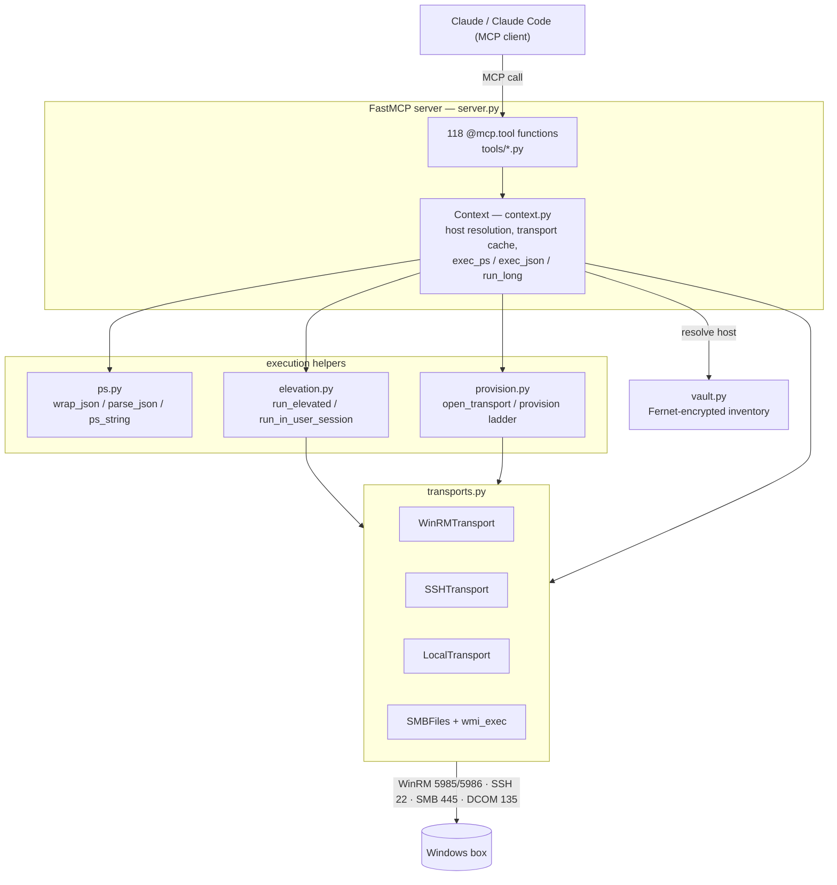

# Architecture

How `winrdp-mcp` works internally — a map of the real modules for contributors and reviewers.

`winrdp-mcp` is a [FastMCP](https://github.com/jlowin/fastmcp) server that provisions and administers Windows RDP boxes (Win10/11, Server 2016–2025) with **nothing pre-installed on the target**. It exposes 118 tools across ten modules and reaches boxes over WinRM, SSH, SMB, or DCOM/WMI. This document traces a request from Claude down to the box and back, then describes each internal subsystem in the order the code layers on top of itself: transports → PowerShell marshaling → provisioning → elevation → execution context → vault → tooling → server registration.

Every path, port, env var, and function name below is taken from the source; file references point at the module that owns the behavior.

## Table of contents

1. [High-level design](#1-high-level-design)
2. [Transport layer](#2-transport-layer-transportspy)
3. [PowerShell marshaling](#3-powershell-marshaling-pspy)
4. [Provisioning ladder](#4-provisioning-ladder-provisionpy)
5. [Elevation](#5-elevation-elevationpy)
6. [Execution context](#6-execution-context-contextpy)
7. [Vault](#7-vault-vaultpy)
8. [Tooling staging](#8-tooling-staging-toolingpy)
9. [Server assembly, annotations, allowlist](#9-server-assembly-annotations-and-allowlist-serverpy)
10. [Module map](#10-module-map)

---

## 1. High-level design

### Two modes, one package

`winrdp_mcp/__main__.py` (the `click` CLI) exposes both run modes. They build the *same* server via `build_server()` in `winrdp_mcp/server.py`; they differ only in which `Context` and seed host they start with.

| Mode | Command | Where it runs | Transport to the box |
|------|---------|---------------|----------------------|
| **Controller** | `winrdp-mcp serve` (or `python -m winrdp_mcp serve`) | On the operator machine, next to Claude Code, MCP over **stdio** (`--http` for HTTP) | Remote: WinRM / SSH / SMB+DCOM |
| **Agent** | `winrdp-mcp agent` | On the managed box itself | `LocalTransport` (`transport=local`) |

```powershell
# Controller (stdio) — this is what Claude Code launches
winrdp-mcp serve
python -m winrdp_mcp serve          # equivalent

# Controller over HTTP for a remote client
winrdp-mcp serve --http --host 127.0.0.1 --port 8765

# On-box agent (seeds a "local" host, transport=local)
winrdp-mcp agent
```

`serve` calls `build_server(local=local, debug=debug)`; `agent` calls `build_server(local=True, seed_host=Host(alias="local", host="localhost", transport="local"))`. Other CLI verbs — `bootstrap`, `add-host`, `list-hosts`, `provision` — operate on the shared vault without starting the server.

### Layer cake



### Request flow

A structured tool call travels a fixed path:

1. **Claude → tool.** FastMCP dispatches to an `@mcp.tool` function in `winrdp_mcp/tools/*.py`. Every tool takes an optional `host=` argument (defaults to the active host).
2. **Tool → context.** The tool builds a PowerShell body (assigning `$result`) and calls `ctx.exec_json(body, host=, elevated=)` or a raw `ctx.exec_ps(...)`. `Context.resolve()` picks the target `Host` from the vault; `Context.transport_for()` returns a cached, live `Transport`.
3. **Context → ps.py.** `exec_json` wraps the body with `ps.wrap_json` (safety prologue + JSON sentinels); `exec_ps` optionally applies `ps.wrap_plain`.
4. **Context → transport.** The wrapped script goes to `transport.run_ps(script, timeout=)`. Elevation and long-op detours (below) are decided here.
5. **Transport → box.** WinRM ships the script over WSMan; SSH/Local ship a base64 `-EncodedCommand`.
6. **Box → back up.** Delimited JSON returns through `run_ps`; `ps.parse_json` extracts it between the sentinels; the tool returns a dict/list to Claude.

Nothing above the transport layer knows *how* the command reached the box. That decoupling is the core design invariant (`transports.py` module docstring).

---

## 2. Transport layer (`transports.py`)

Every transport implements the same tiny surface, so structured tools never branch on connection type:

```
run_ps(script, timeout)   -> ExecResult   # run PowerShell, return stdout/stderr/rc
run_cmd(command, timeout) -> ExecResult   # run a cmd.exe command line
upload(data, remote_path) -> None         # push bytes to the box
download(remote_path)     -> bytes        # pull bytes from the box
probe()                   -> bool         # is this transport usable right now?
close()                   -> None
is_elevated()             -> bool         # does this session already hold a full token?
```

`ExecResult` is a dataclass of `(stdout, stderr, rc)` with `.ok` (`rc == 0`) and `.raise_for_status(what)` which raises `TransportError` with the trimmed stderr/stdout on failure.

`Transport.is_elevated()` runs a one-shot `WindowsPrincipal.IsInRole(Administrator)` check that emits `ELEV_YES`/`ELEV_NO`, and **caches** the result per transport in `_elevated`. This is the fast-path signal the elevation logic keys on (see §5).

### WinRM — `WinRMTransport`

- Lazily imports `winrm` (pywinrm) so the base package import stays cheap.
- Endpoint `http(s)://{host}:{port}/wsman`; default port 5985 (HTTP) or 5986 (HTTPS). User is `DOMAIN\user` when a domain is set. Auth defaults to `ntlm`.
- Per-operation timeouts come from `WINRM_OP_TIMEOUT` (env `WINRDP_WINRM_OP_TIMEOUT`, **default 180 s**); `read_timeout_sec` is `WINRM_OP_TIMEOUT + 30`. The read timeout must exceed the operation timeout, which is why it is derived, not independent.
- **`run_ps` uses pywinrm's native `session.run_ps(script)`** — the script text goes over WSMan directly (pywinrm base64-encodes it internally). This differs from SSH/Local, which build their own `-EncodedCommand` (see below).
- `run_cmd` calls `session.run_cmd("cmd.exe", ["/c", command])`.

**Self-heal reconnect.** A remote `OperationTimeout` or overload can close the socket (`RemoteDisconnected`) or wedge the WSMan shell so every subsequent request answers HTTP 400. `_is_recoverable(exc)` classifies these (requests `ConnectionError`/`ChunkedEncodingError`/`Timeout`, or a pywinrm `WinRMTransportError` with code 400/500, or the strings `Code 400`/`Code 500`/`RemoteDisconnected`). `_run(fn)` wraps every pywinrm call: on a recoverable error it tears down and rebuilds the session via `_connect()` and **retries exactly once**; a second failure propagates.

> **Load-bearing lesson (in the source comment).** There is deliberately **no thread-based watchdog** around pywinrm calls. `winrm.Session` (a `requests.Session` plus the open WSMan shell) is **not thread-safe**; abandoning a call mid-flight from a watchdog corrupts the shell and makes every later request return HTTP 400. Per-call bounding comes solely from `read_timeout_sec`; a dropped/wedged connection is healed by `_run` reconnecting and retrying. Do not reintroduce a watchdog thread.

### SSH — `SSHTransport`

- `paramiko.SSHClient`, port 22. `host_key_policy="auto"` is trust-on-first-use (`AutoAddPolicy`, pragmatic for fresh boxes); `"reject"` (`RejectPolicy`) only accepts keys already in `known_hosts` (production).
- `run_ps` builds `powershell -NoProfile -NonInteractive -EncodedCommand <b64>` via `ps.encode_command` — the UTF-16LE/base64 blob sidesteps all shell quoting.
- `run_cmd` explicitly re-enters cmd.exe: `& $env:ComSpec /c <ps_string(command)>`. Provisioning sets PowerShell as the SSH `DefaultShell`, so a bare command line would otherwise run under PowerShell and mangle cmd builtins like `schtasks`/`shutdown`/`netsh`.
- `upload`/`download` use **SFTP** (`open_sftp` + `putfo`/`getfo`) — far faster than base64 chunking — after ensuring the parent directory. Windows paths are converted with `\` → `/`.

### Local — `LocalTransport`

- Agent mode / managing the box the server runs on. `run_ps` launches `powershell.exe` (or `pwsh` off-Windows) with `-EncodedCommand`; `run_cmd` shells `cmd.exe /c` on Windows. `upload`/`download` are direct file I/O. `probe()` is `os.name == "nt"`.

### The default upload/download (WinRM & base transport)

`Transport.upload` is the everywhere-works fallback used by WinRM:

1. Ensure the parent dir exists and delete any existing target file.
2. Zero-byte files are written directly with `[IO.File]::WriteAllBytes(path, [byte[]]@())` (skips the loop).
3. Otherwise base64-encode the bytes and append them to a `<path>.b64` temp file in **`_CHUNK = 6000`-char slices** via `Add-Content -NoNewline` — kept well under SOAP/line limits.
4. Decode on the box (`[Convert]::FromBase64String`), write the real file, remove the temp.

`Transport.download` is the mirror image: `[Convert]::ToBase64String([IO.File]::ReadAllBytes(path))` on the box, `base64.b64decode` locally.

### SMB and WMI (cold-start only)

`SMBFiles` is a **file-only** transport over the admin share (`\\host\C$\...` via `smbprotocol`/`smbclient`) — `write`, `read`, `probe`, no command execution. `wmi_exec(...)` is fire-and-forget `Win32_Process.Create` over DCOM/WMI using the optional `impacket` dependency (needs TCP 135 + high RPC ports). Together they exist purely to stage and launch the bootstrap when both WinRM and SSH are off (§4, rung 3).

---

## 3. PowerShell marshaling (`ps.py`)

Every structured tool funnels output through here so results are deterministic and machine-parseable despite PowerShell's habit of printing banners and collapsing single-element arrays.

### Safety prologue

`_PROLOGUE` prepends to wrapped scripts:

```powershell
$ErrorActionPreference='Stop';
$ProgressPreference='SilentlyContinue';
[Console]::OutputEncoding=[Text.Encoding]::UTF8;
```

### `wrap_json(body, depth=6)` — sentinel-delimited JSON

The body must assign its result to `$result`. `wrap_json` emits the JSON payload bracketed by two sentinels so it survives stray text around it:

```
<<<WINRDP_JSON_BEGIN>>>
{ ...ConvertTo-Json -Depth <depth> -Compress... }
<<<WINRDP_JSON_END>>>
```

The whole body runs inside `try{ ... }catch{ ... }`. On error it emits (still between sentinels) a JSON object `{error, category, target}` built from the `$_.Exception` and `CategoryInfo` — so a failure round-trips as structured data, not a crash.

### `parse_json(stdout)`

Finds `BEGIN`/`END`, slices the blob between them, and `json.loads` it. Missing sentinels raise `ValueError` with the first 2000 chars of output for diagnosis; an empty blob returns `None`.

### Quoting and normalization helpers

- **`ps_string(value)`** — quotes a Python string as a PowerShell single-quoted literal, doubling embedded `'` (`it's` → `'it''s'`). This is the single choke point for injecting untrusted paths/values into scripts; nearly every module calls it.
- **`as_list(value)`** — normalizes PowerShell's single-element-array-collapses-to-scalar behavior back to a Python list (`None` → `[]`, scalar → `[scalar]`).
- **`encode_command(script)`** — UTF-16LE + base64 for `-EncodedCommand`; used by SSH and Local `run_ps` and by `bootstrap_oneliner`.
- **`wrap_plain(body)`** — prologue only, no JSON (used by `exec_ps(..., wrap=True)`).
- **`ensure_remote_dirs()`** — snippet that creates `REMOTE_ROOT`, `REMOTE_TOOLS`, `REMOTE_TMP` if absent.

---

## 4. Provisioning ladder (`provision.py`)

Goal: given a host + admin creds, make the box manageable regardless of Windows version or what's currently enabled. `provision(h)` climbs the ladder best-rung-first and mutates `h.resolved_transport`. `open_transport(h)` is the no-cold-start path used for an already-provisioned box.

```mermaid
sequenceDiagram
    participant C as Claude
    participant T as provisioning tool
    participant P as provision.py
    participant Box as Windows box

    C->>T: provision_host(alias)
    T->>P: provision(h)
    P->>Box: _scan() ports 5985/5986/22/3389/445/135

    Note over P,Box: Rung 1 — WinRM already up
    P->>Box: _try_winrm(h) probe ($true)
    alt WinRM reachable
        Box-->>P: ok
        P->>Box: _harden_winrm — run ENABLE_WINRM_PS (idempotent)
        P-->>T: transport=winrm, success
    else not reachable
        Note over P,Box: Rung 2 — SSH
        P->>Box: _try_ssh(h) probe
        alt SSH reachable
            Box-->>P: ok
            P->>Box: run ENABLE_WINRM_PS over SSH
            P->>Box: re-probe WinRM; prefer it if up
            P-->>T: transport=winrm (or ssh)
        else not reachable
            Note over P,Box: Rung 3 — SMB(445)+DCOM(135) cold start
            P->>Box: SMBFiles.write bootstrap.ps1 to REMOTE_TMP
            P->>Box: wmi_exec Win32_Process.Create (impacket)
            P->>Box: poll port 5985 up to ~30s
            alt WinRM came up
                P->>Box: _try_winrm + _harden_winrm
                P-->>T: transport=winrm, success
            else still nothing
                Note over P,Box: Rung 4 — paste-once bootstrap
                P-->>T: bootstrap_oneliner + instructions, success=false
            end
        end
    end
```

### The canonical enable script — `ENABLE_WINRM_PS`

Idempotent and safe to re-run. It:

- Sets any **Public** network connection profile to **Private** first (a Public profile blocks `Enable-PSRemoting`/quickconfig).
- `Enable-PSRemoting -Force -SkipNetworkProfileCheck`, sets WinRM service to Automatic, starts it, runs `winrm quickconfig`.
- Enables `Service\Auth\Basic`, `Service\AllowUnencrypted`, and `Client\TrustedHosts = *` for first contact.
- **Sets `LocalAccountTokenFilterPolicy = 1`** (DWord under `HKLM:\...\Policies\System`) so a **non-builtin local admin gets a full token over the network** — this is what makes elevated ops run directly over WinRM (§5) and fixes "Access is denied" for such accounts.
- Opens the firewall (`Enable-NetFirewallRule -DisplayGroup 'Windows Remote Management'` + an explicit 5985 rule) and prints `WINRDP_WINRM_ENABLED`.

`ENABLE_SSH_PS` is the parallel installer for OpenSSH.Server: installs the capability, starts `sshd`, opens port 22, and sets `HKLM:\SOFTWARE\OpenSSH\DefaultShell` to `powershell.exe`.

### The four rungs

1. **WinRM reachable** — `_try_winrm(h, use_ssl)` then the opposite SSL setting; on success, re-run the enable script through the live session (`_harden_winrm`) and return `transport=winrm`.
2. **SSH reachable** — run `ENABLE_WINRM_PS` over SSH; if WinRM comes up, switch to it; otherwise keep SSH.
3. **SMB + DCOM cold start** (`_cold_start_wmi`, needs `allow_wmi_bootstrap` and both ports) — write `REMOTE_TMP\bootstrap.ps1` (encoded **UTF-8 with BOM** so `powershell -File` decodes it correctly), launch it fire-and-forget via `wmi_exec`, then poll port 5985 for up to ~30 s (15 × 2 s). Requires the optional `winrdp-mcp[bootstrap]` extra (impacket).
4. **Paste-once bootstrap** — return `bootstrap_oneliner(h)`, a single `powershell -NoProfile -ExecutionPolicy Bypass -EncodedCommand <b64 of ENABLE_WINRM_PS>` line the operator pastes into an existing RDP/console session, then re-runs `provision()`.

Results are reported in a `ProvisionReport` (`.to_dict()` includes `reachable_ports`, `transport`, `winrm_enabled`, `ssh_enabled`, `actions`, `bootstrap_oneliner`, `success`, `message`).

`open_transport(h)` (the hot path once provisioned) tries transports in preference order — HTTP 5985 first unless the host opted into SSL, then HTTPS 5986, then SSH — and sets `h.resolved_transport`. It raises `TransportError("... Run provision() first")` if nothing answers.

---

## 5. Elevation (`elevation.py`)

Two real mechanisms, not "please run as admin," plus the interactive-desktop path and the long-op path. The decision lives in `context.exec_ps` / `exec_json` and keys on `transport.is_elevated()`.

### Fast path — already-elevated over WinRM

Over WinRM, a local admin on a box with `LocalAccountTokenFilterPolicy=1` (set during provisioning) **already holds a high-integrity full token**. `transport.is_elevated()` detects this and caches it. When a tool requests `elevated=True` and the session is already elevated, `exec_ps` runs the script **directly** — no scheduled task, no extra round trips. This is the common, fast case.

### Fallback — one-shot SYSTEM Scheduled Task (`run_elevated`)

When the session token is *filtered* (SSH logon, or a non-elevated local run), `exec_ps`/`exec_json` route through `elevation.run_elevated`:

1. Build a wrapper script that runs `& { <script> } 1> out 2> err`, records `$LASTEXITCODE`, and writes a `.done` marker (`rc=<n>`) in a `finally` block. Uploaded as **UTF-8 with BOM** to `REMOTE_TMP\winrdp_elev_<rid>.ps1`.
2. Register the task **entirely through the `ScheduledTasks` cmdlets inside PowerShell** — `New-ScheduledTaskAction` + `New-ScheduledTaskPrincipal -UserId 'SYSTEM' -LogonType ServiceAccount -RunLevel Highest` + `Register-ScheduledTask -Force` + `Start-ScheduledTask`. A `SYSTEM` principal with `RunLevel Highest` gets a full unfiltered token, bypassing UAC token filtering. Doing this via cmdlets (not the `schtasks` CLI) deliberately avoids the `schtasks` + `list2cmdline` quoting corruption of nested quotes across transports.
3. Poll `Test-Path` on the `.done` marker until it appears or `timeout` (default 300 s) elapses; read back `out`/`err`/`done`; parse `rc`.
4. **Always** clean up in `finally`: `Unregister-ScheduledTask` + `Remove-Item` of the `.ps1`/`.out`/`.err`/`.done`.

A non-SYSTEM `run_as` variant registers with `-User`/`-Password` instead of the SYSTEM principal.

### Interactive desktop — `run_in_user_session`

For anything that must touch the visible desktop/GUI (e.g. `screenshot`, clipboard). Reached via `run_powershell(as_user=True)` → `exec_ps(as_user=True)`. It discovers the console user (`Win32_ComputerSystem.UserName`, falling back to `quser`), registers a task with `-LogonType Interactive -RunLevel Limited` bound to that user so the process attaches to the visible session, polls the done-marker, and cleans up. A persistent GUI launcher that never exits is reported as `still running (no exit captured)`.

### Detached long ops — `run_long`

`context.run_long(script, timeout=1800)` runs a minutes-scale command (a package install, Windows Update) **detached** by delegating to `run_elevated` (SYSTEM scheduled task) and polling a done-marker with short calls. A multi-minute op cannot be held open on a single WinRM request — a busy/small box drops the connection — but the short poll calls survive a mid-install disconnect because the transport self-heals (§2). This is used by `run_python`'s `_install_python`, `install_software`, and `ensure_runtime`.

---

## 6. Execution context (`context.py`)

`Context` is the single object every tool shares. It owns the vault, resolves the target host, caches open transports, and exposes the three primitives tools use: `exec_ps`, `exec_json`, `transport_for` (plus `run_long`, `provision`, `invalidate`).

### Host resolution

`resolve(host)` returns the named `Host` from the vault, or the **active** host when `host` is omitted (`host=` is optional on every tool). Unknown alias → `KeyError` with a hint; no active host → `KeyError` telling the caller to `add_host` + `use_host`.

### Transport cache and invalidation

`transport_for(host)` memoizes one live `Transport` per host alias in `self._transports` under an `RLock`. The open happens **outside the lock** so concurrent first-connects to *different* boxes (the `run_on_hosts` fan-out) run in parallel instead of serializing; a double-open race is resolved by keeping the first winner and closing the loser. On success it persists `h.resolved_transport` via `vault.update`.

`invalidate(alias)` pops and closes the cached transport (called by `provision()` before re-provisioning). `close()` tears down every cached transport.

### Execution primitives

- **`exec_ps(body_or_script, host=, wrap=, elevated=, as_user=, timeout=)`** — resolves host + transport, optionally applies `wrap_plain`, then dispatches by mode: `as_user` → `run_in_user_session`; `elevated and not is_elevated()` → `run_elevated` (SYSTEM); otherwise a direct `transport.run_ps`. Timing/failure is logged at debug/warning.
- **`exec_json(body, host=, elevated=, depth=6, timeout=)`** — wraps the body with `wrap_json`, runs it (via `run_elevated` when elevation is needed and the session is filtered, else via `exec_ps`), and returns `parse_json(stdout)`.
- **`run_long(...)`** — the detached long-op path described in §5.

---

## 7. Vault (`vault.py`)

An encrypted host inventory. Passwords are encrypted at rest with **Fernet** (AES-128-CBC + HMAC); everything else (host, ports, user, transport hints, tags) stays clear so the inventory JSON is human-readable.

### Key sourcing (`_load_key`)

1. **`$WINRDP_VAULT_KEY`** if set. It is accepted either as a raw Fernet key *or* as an arbitrary passphrase — if `Fernet(value)` doesn't validate, the value is SHA-256'd and urlsafe-base64-encoded into a valid key.
2. Otherwise a **machine-local key file** at `data_dir()/vault.key`. On first use it is created with `os.open(..., 0o600)` (owner-only from the start, no world-readable window on POSIX); on Windows the DACL is additionally tightened with `icacls /inheritance:r /grant:r <user>:F`. A warning notes that on-disk encryption only guards ciphertext-only theft and recommends `WINRDP_VAULT_KEY`.

### `Host` and persistence

The `Host` dataclass carries `alias`, `host`, `username`, `password` (in-memory clear, persisted encrypted), `domain`, `transport` (`auto|winrm|ssh|local`), WinRM/SSH/RDP ports, `use_ssl`, `winrm_auth`, the security-posture fields `winrm_cert_validation` (`ignore|validate`) and `ssh_host_key_policy` (`auto|reject`), the provision-populated `resolved_transport`, `notes`, and `tags` (for fan-out grouping). `redacted()` masks the password for anything returned to the model.

`load()`/`save()` serialize to `data_dir()/inventory.json` with the password stored as `password_enc` (Fernet ciphertext) and everything else via `asdict`. `save()` writes to a `.tmp` sibling and atomically `replace`s. On load, a decrypted password is passed to `log.register_secret` so it is scrubbed from every log line by exact match. `save()` writes atomically; CRUD (`add`/`remove`/`get`/`all`/`set_active`/`update`) tracks the active alias and re-saves.

`data_dir()` (`config.py`) is `$WINRDP_HOME` if set, else `%APPDATA%\winrdp-mcp` on Windows (`$XDG_DATA_HOME/.local/share` otherwise).

---

## 8. Tooling staging (`tooling.py`)

Lets Claude pull helpers onto a box mid-task. Everything lands under **`C:\ProgramData\winrdp-mcp\tools`** (`config.REMOTE_TOOLS`) and is tracked in an on-box `_manifest.jsonl`.

- **`stage_tool(transport, source, name=, timeout=300)`** — `source` may be a **preset** name, an **http(s) URL**, or a **local file** on the operator machine. Presets (`PRESETS`) are Sysinternals shortcuts: `psexec`, `handle`, `procdump`, `autoruns`, `tcpview`, `pslist`, `accesschk`, `sigcheck` (all from `live.sysinternals.com`). URLs/presets are downloaded **on the box** via `Net.WebClient` with TLS 1.2 forced, returning `{name, remote_path, bytes, sha256}` from `Get-FileHash`.
- **`stage_script(transport, content, name)`** — writes an inline script into the cache (defaults extension to `.ps1` if not one of `.ps1/.bat/.cmd/.py/.txt`).
- **`stage_local_file(transport, local_path, name=)`** — uploads an operator-machine file into the cache.
- **`list_staged(transport)`** — enumerates the cache directory as `{name, path, bytes, modified}`.
- **`cleanup(transport, name=)`** — removes one file, or the entire `REMOTE_TOOLS` tree when `name` is omitted.

Each stage records a best-effort line in `REMOTE_TOOLS\_manifest.jsonl` (`{name, path, source, sha256}`). These map to the MCP tools `stage_tool` / `stage_script` / `list_staged_tools` / `cleanup_staged`.

---

## 9. Server assembly, annotations, and allowlist (`server.py`)

`build_server(local=, seed_host=, debug=)` wires everything together:

1. `log.setup(debug)` — logging goes **only to stderr** (stdout is the MCP protocol channel). `WINRDP_DEBUG=1` (or `--debug`) raises the level to DEBUG. A `_RedactFilter` scrubs registered secrets (exact match) plus structural patterns from every record.
2. Construct the `Context` (seeding a `local` host in agent mode / `--local`).
3. Create `FastMCP("winrdp-mcp", instructions=INSTRUCTIONS)` — `INSTRUCTIONS` is the model-facing quickstart (add_host → provision_host → administer).
4. `_install_tool_wrapper(mcp)` — see below.
5. Register a `GET /health` route returning `{status, version, hosts}`.
6. `register_all(mcp, ctx)` — iterates `tools/__init__.py::MODULES` and calls each module's `register(mcp, ctx)`.

### Safety annotations + allowlist wrapper

`_install_tool_wrapper` monkeypatches `mcp.tool` so **every** registered tool gets MCP `ToolAnnotations` and honors two env allowlists:

- Tools in the **`READONLY`** set → `readOnlyHint=True, destructiveHint=False` (e.g. `system_info`, `list_hosts`, `rdp_status`, `screenshot`, `file_read`). Safe to auto-run.
- Tools in the **`DESTRUCTIVE`** set → `destructiveHint=True` (e.g. `reboot`, `file_delete`, `kill_process`, `user_delete`, `rdp_disable`, `uninstall_software`, `clear_event_log`). Clients should gate these behind confirmation.
- Everything else → mutating-but-not-destructive (`readOnlyHint=False, destructiveHint=False`).

The wrapper also applies:

- **`WINRDP_ENABLED_TOOLS`** (CSV) — if set, **only** these tools are registered.
- **`WINRDP_DISABLED_TOOLS`** (CSV) — these tools are skipped.

A tool skipped by the allowlist is not registered with FastMCP but the underlying function stays callable in-process. Annotations are only auto-attached when the caller didn't pass its own `annotations=`.

---

## 10. Module map

| Path | Responsibility |
|------|----------------|
| `winrdp_mcp/__main__.py` | `click` CLI: `serve`, `agent`, `bootstrap`, `add-host`, `list-hosts`, `provision` |
| `winrdp_mcp/server.py` | FastMCP assembly, safety annotations, tool allowlist, `/health` |
| `winrdp_mcp/context.py` | Shared `Context`: host resolution, transport cache, `exec_ps`/`exec_json`/`run_long` |
| `winrdp_mcp/transports.py` | `WinRMTransport`, `SSHTransport`, `LocalTransport`, `SMBFiles`, `wmi_exec`; self-heal, chunked upload |
| `winrdp_mcp/ps.py` | Script wrapping, JSON sentinels, `ps_string`, `as_list`, `encode_command` |
| `winrdp_mcp/provision.py` | The provisioning ladder + `open_transport` + enable scripts |
| `winrdp_mcp/elevation.py` | SYSTEM scheduled-task elevation, interactive-desktop runs, UAC policy helpers |
| `winrdp_mcp/vault.py` | Fernet-encrypted `Host` inventory, key sourcing |
| `winrdp_mcp/tooling.py` | On-demand staging of scripts/tools into `C:\ProgramData\winrdp-mcp\tools` |
| `winrdp_mcp/config.py` | Data-dir/path resolution, remote staging paths, default ports |
| `winrdp_mcp/log.py` | stderr-only logging + secret redaction |
| `winrdp_mcp/tools/` | The 118 tools across `hosts`, `provisioning`, `system`, `scripting`, `files`, `admin`, `rdp`, `software`, `network`, `windows` — each exposes `register(mcp, ctx)` |

### Config surface (env vars)

| Var | Effect |
|-----|--------|
| `WINRDP_VAULT_KEY` | Fernet key or passphrase encrypting stored passwords (else machine-local `vault.key`) |
| `WINRDP_HOME` | Override the per-user data dir (inventory + vault key) |
| `WINRDP_DEBUG` | `1`/`true`/`yes` → DEBUG logging to stderr |
| `WINRDP_WINRM_OP_TIMEOUT` | WinRM per-operation timeout in seconds (default 180; read timeout = +30) |
| `WINRDP_ENABLED_TOOLS` | CSV allowlist — register only these tools |
| `WINRDP_DISABLED_TOOLS` | CSV blocklist — skip these tools |
